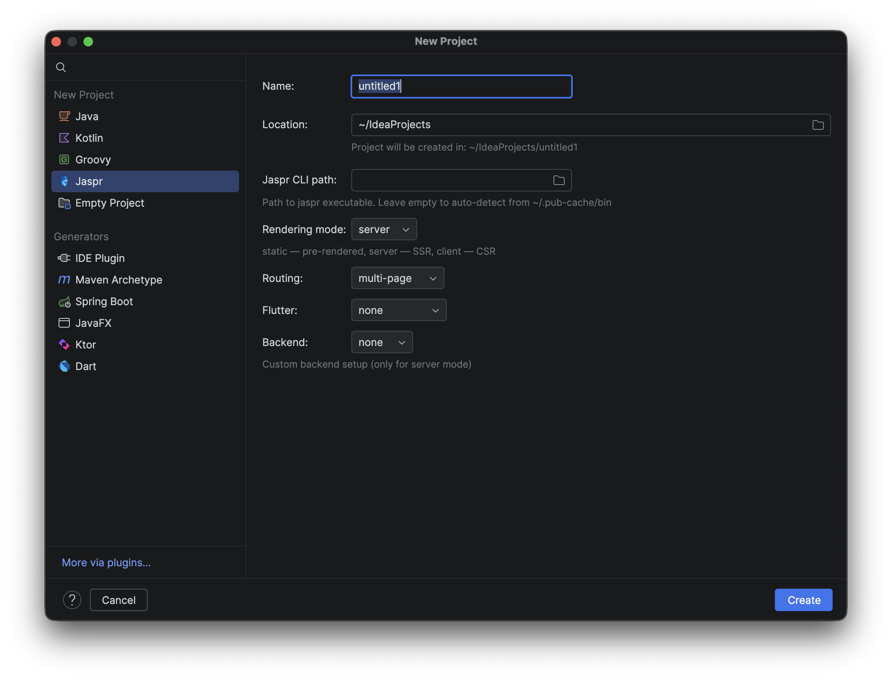
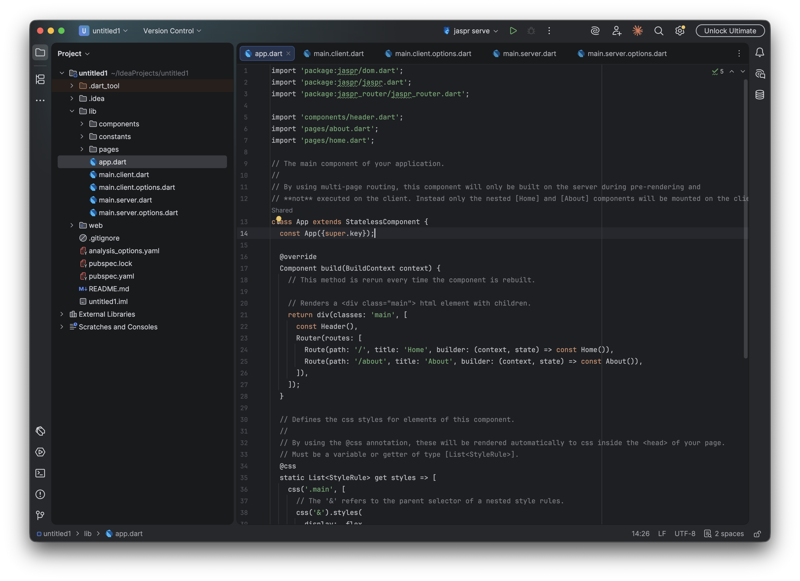

# Jaspr Plugin for IntelliJ IDEA

[](https://github.com/AurelVU/jetbrains-jaspr/actions/workflows/build.yml)
[](https://plugins.jetbrains.com/plugin/30867-jaspr)
[](https://plugins.jetbrains.com/plugin/30867-jaspr)

IDE support for the [Jaspr](https://docs.page/schultek/jaspr) Dart web framework in IntelliJ IDEA, Android Studio, and other JetBrains IDEs.

<a href="https://plugins.jetbrains.com/plugin/30867-jaspr">

</a>

## Features

### New Project Wizard

Create a new Jaspr project directly from **File > New Project > Jaspr**. Configure rendering mode (static / server / client), routing, Flutter embedding, and backend setup — the wizard runs `jaspr create` with the selected options and sets up run configurations automatically.



### Project Structure & Run Configurations

Built-in run configuration type for `jaspr serve` and `jaspr build`. Supports custom port, `--no-ssr` flag, target file, and additional CLI arguments. Auto-created when using the New Project wizard. Dart SDK is configured automatically.



### Component Scope Indicators

Code Vision labels above each Jaspr component class show its rendering scope — **Server**, **Client (hydrated)**, **Island**, or **Shared**. Click the label for a detailed explanation.

### Code Completion

Context-aware completion for Jaspr HTML helpers (`div`, `span`, `a`, `img`, etc.), component annotations (`@client`, `@island`), and common patterns.

### Additional Features

- **Component highlighting** — custom color scheme for `@client` and `@island` annotations
- **File templates** — quickly create Jaspr components and pages via **New > Jaspr**
- **Inspections** — validates `@client` annotation usage (only one per file)
- **Intentions** — wrap selection with a Jaspr component
- **Dart SDK auto-configuration** — automatically enables Dart support in new projects
- **Configurable CLI path** — set a custom `jaspr` executable in **Settings > Languages & Frameworks > Jaspr**

## Installation

### From JetBrains Marketplace

1. Open **Settings > Plugins > Marketplace**
2. Search for **"Jaspr"**
3. Click **Install** and restart the IDE

### From Disk

1. Download the latest release from [GitHub Releases](https://github.com/AurelVU/jetbrains-jaspr/releases)
2. Open **Settings > Plugins > gear icon > Install Plugin from Disk...**
3. Select the downloaded `.zip` file and restart

## Requirements

- IntelliJ IDEA 2024.3+ (or compatible JetBrains IDE)
- [Dart plugin](https://plugins.jetbrains.com/plugin/6351-dart) installed
- [Jaspr CLI](https://docs.page/schultek/jaspr) installed (`dart pub global activate jaspr_cli`)

## Development

```bash
# Build the plugin
./gradlew buildPlugin

# Run tests
./gradlew test

# Run IDE with plugin for testing
./gradlew runIde

# Verify plugin compatibility
./gradlew verifyPlugin
```

## License

See [LICENSE](LICENSE) for details.
